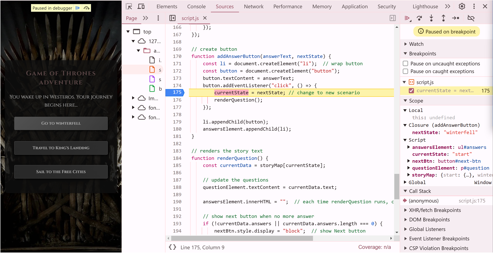
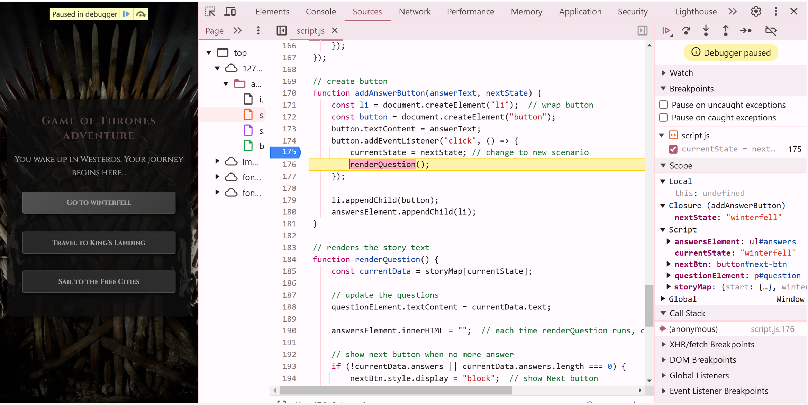
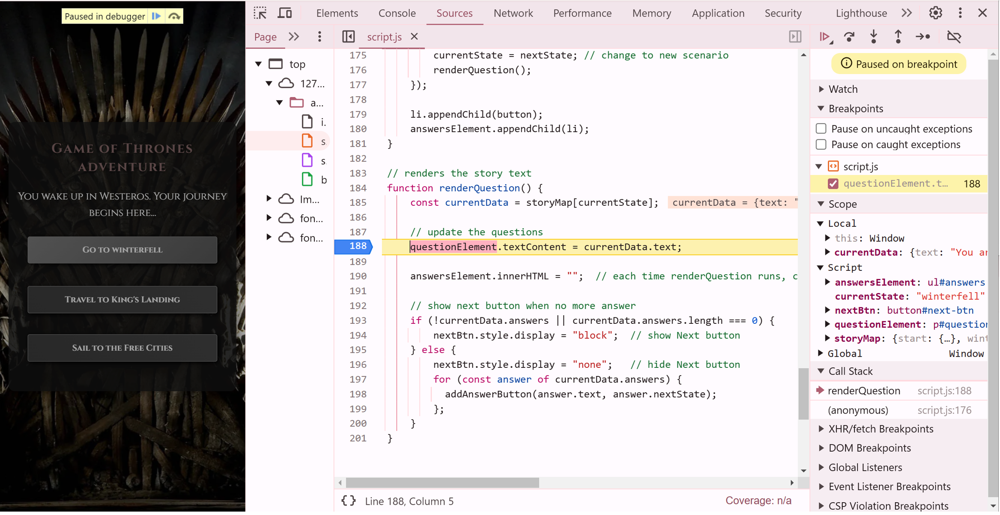
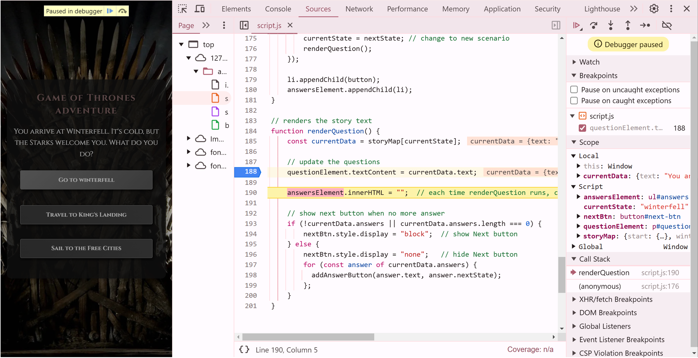
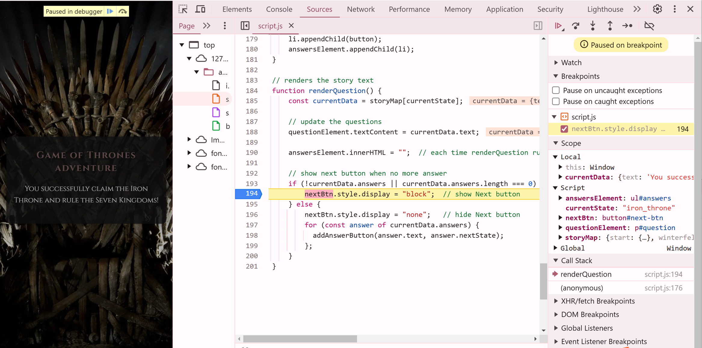
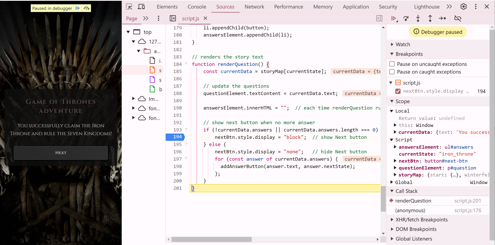

# Debugging Analysis

This is a debugging analysis of the Game of Thrones adventure game.  
There are three breakpoints with explanations, and a critical state analysis.

## Breakpoint 1: `currentState = nextState`

### Why this breakpoint?

This ensures that the game correctly updates `currentState` when users make a choice.

### Screenshot1

Before

`currentState = "start"`
`nextState = "winterfell"`
Execution is paused at `currentState = nextState`

After

`currentState = "winterfell"`
Execution moves to `renderQuestion();`

### What changed?

The game successfully updated `currentState` based on user choice.
`renderQuestion();` will now execute to update the UI.

## Breakpoint 2: `questionElement.textContent = currentData.text;`

### Why this breakpoint?

This ensures that when `renderQuestion()` runs, it updates the UI with the correct story text.

### Screenshot2

Before

`currentState = "winterfell"`
`currentData.text = "You arrive at Winterfell..."`
`questionElement.textContent = "You wake up in Westeros..."` (old UI state)

After

`questionElement.textContent` updates to `"You arrive at Winterfell..."`
Execution moves to clearing old answers

### What changed?

The UI now correctly displays `"You arrive at Winterfell..."`
`answersElement.innerHTML` will be cleared next.

## Breakpoint 3: `nextBtn.style.display = "block";`

### Why this breakpoint?

This ensures that the `"Next"` button is only displayed when game's end.

### Screenshot3

Before

`currentState = "iron_throne"` (game end state)
`currentData.answers = undefined` (no choices left)
`nextBtn.style.display = "none"` (button is hidden)

After

`nextBtn.style.display = "block"` (button is now visible)
UI now shows the `"Next"` button for restarting the game

### What changed?

The `"Next"` button now appears
Ready to restart

## Critical State Analysis: "Next" Button Display

Before
`nextBtn.style.display = "none"`
After
`nextBtn.style.display = "block"` (Next button becomes visible)

### What does this state tell me?

This confirms that `nextBtn` only appears when no more answers.

### Does the program behave as expected? If applicable, explain how this state connects to your program’s next steps

Yes, it does. Next step is that the players can restart the game.
